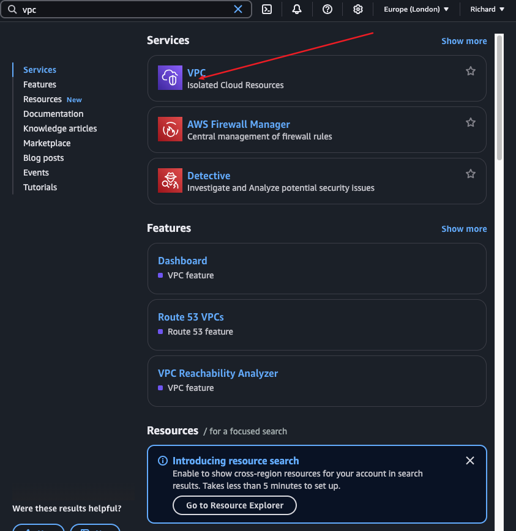

Implementing security Groups Overview and NACLs

exploring the core concept of the Amazon web service which focuses on Security Group Network Access control list (NACL) I will be using the fundamental component of AWS infrascrture including security group to control the inbound and outboud traffic to EC2 instance also using NACL AS SUBNET LEVEL firewall to requlate the traffic entering and exiting the subnet.

# in my previous project i configure a VPC and in the public subnet an Ec2 instance was lunched and running to host our website.

# The next step is to test accessiblity to the website using the public ip address that was assigned to the instance.

> After entering the ip adress to my chrome browser i recieve error message indicating the page can't be reached.
this is because of the security group that we haven't defined HTTP protocol in the security group so whenever the outside world is trying to go inside our instance and trying to get the data, security group is restricting.

# To resolve this issue i csn create a new security group that alllows ahttp (port 80) traffi.

> I navigate to security group section and click on create security group.

> in the next stage i provided a name for my security group, added a discription and ensure to select my VPC during the creation and add rule

> I procced creating my Security group by adding rule to the *inbound rule*
SSH-port 22,  HTTP port-80 and used 0.0.0.0.0/0 as the CIDR.

> I make sure to leave the outband rule as it is, All traffc

> The security group as been created succesfully and the next stage is to attached it with my instance

# The next stage is too attached my sucurity group with my instance,

> i navigate to my instance and select the instance then procced to action where i choose security and click on change security groups

> Next stage i choose the security group i created and click on add security group after chosing my security group, after it was added i procced to click on save 

# My instance as been attached successfully with my security group the next stage is to copy my IP address and paste it on my chrome to see if i will able to see data of our website

>  The ip address  is successfully working 

# The next stage is too take a look at how my inbound and outboubd rules are configured

> The inbound rule setup allow the HTTP and SSH protocols to access the instnce.

> The outband rule set up permits all traffic to exit the inatnce

> Through this rule, we're able to access the website 

>  when the outbound rule is removed the website is still accessable because the security group is stateful meaning they automatically allow traffic to return to the instance which they are attached to

> Now that outbound has been removed lets take a look at how it appear in the configuration

# After making this change lets whether we can still access the website succesfully.

> even though i have removed the outbound rule that allow all traffic from the instance to the outside world, i can still access the website.

> when the inbound rule is removed, enssentially we're closing all access to and from the instance

> The ip address can't acess the website any longer 

# NACL

# Navigate to VPC on aws and click on it

> I procced to create network ACL ON VPC

> I provided a name for my network ACL and ensure to choose my VPC that i created in the previous session

# After creating my Networl ACl i navigate to the inbound section and notice that it's denying all traffic fron port.

> similarly on outbound section the traffic was denying

> After noticing that the traffic as been denying on both section we need to maken changes on both and allow all traffic

> first i navigate to my inbound section and click on edit inbound.

> The next stage is to click on add rule, i choose (1)for the rule number, All traffic was allow and 0.0.0.0/0 for the source 

# After allowing traffic with NACL, Currently, the NACL is not associated with any of the subnet.

> Next step is too associate the NACL with the subnet, by selecting my NACL  click on action to edit the subnet association

> After selecting my public subnet and and click on save 
> NACL is succefully associated with the  subnet.

> I followed the same procces to edit my outband rule by allowing traffi

> On outbound traffic i choose (1)for the rule number, All traffic was allow and 0.0.0.0/0 for the source

# Project reflection 

> overall gained pratical exprience and confidence in nmanaging network security within AWS environments

> explored various scenarios to undestand how security Groups and NACLs interact

